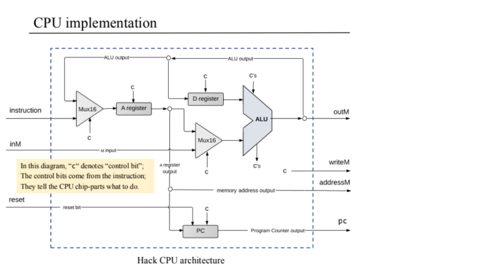
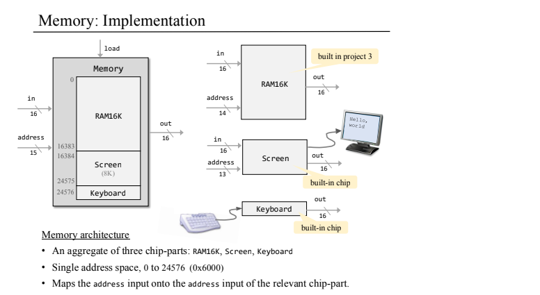
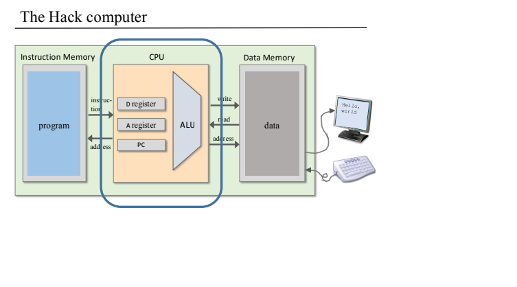

# Project 5: Computer Architecture - CPU

In this project, the goal was to implement the Hack CPU using HDL (Hardware Description Language). The CPU executes instructions by integrating previously built components such as the ALU, registers, and program counter.

### Key Components Implemented

- **CPU.hdl** – Integrates the Hack CPU, executing instructions and managing data flow between registers and memory, utilizing components developed in previous projects.
- **Memory.hdl** – Combines the complete address space of the Hack computer's memory, including RAM and memory-mapped I/O, leveraging components from earlier projects.
- **computer.hdl** – Assembles the CPU, ROM, and RAM to form the complete Hack computer system, building upon the foundation established in projects 1 to 4.
- **All necessary supporting chips built before(ALU, Register, PC, etc.)**

## Features

- Handles both A-instructions and C-instructions.
- Supports ALU operations, destination flags, jump conditions.
- Updates program counter correctly based on jump logic and reset signals.

