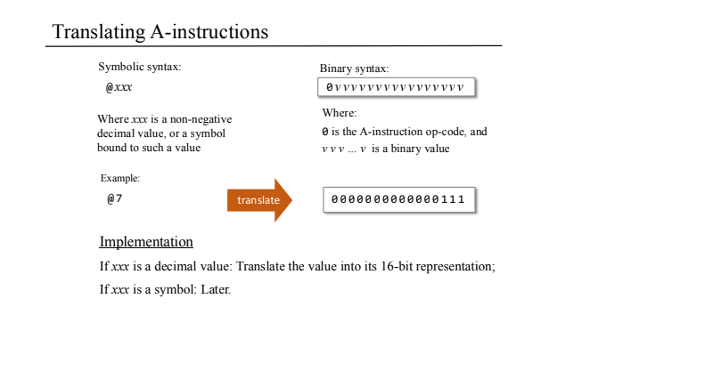
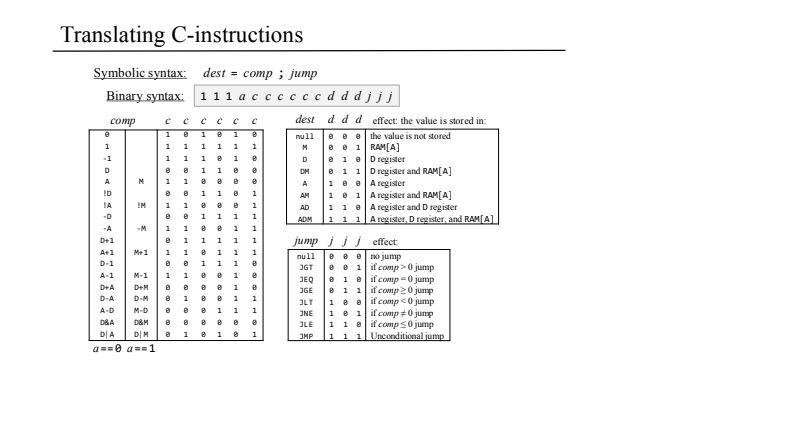

# Project 6: Assembler

The objective of this project is to develop an assembler that translates Hack assembly language programs into binary machine code(.hack) executable on the Hack hardware developed in project 5. This assembler processes `.asm` files and outputs corresponding `.hack` files containing 16-bit binary instruction.

## Features

 Two-pass assembly proces:
   First pass to record label definitions and their corresponding addresse.
   Second pass to translate instructions into binary cod.
 Support for A-instructions (`@value`) and C-instructions (`dest=comp;jump`)

 Handling of predefined symbols (e.g., `SP`, `LCL`, `ARG`, `THIS`, `THAT`, `R0`–`R15`, `SCREEN`, `KBD`)

 Dynamic allocation of memory addresses for user-defined variables starting from address 1.

