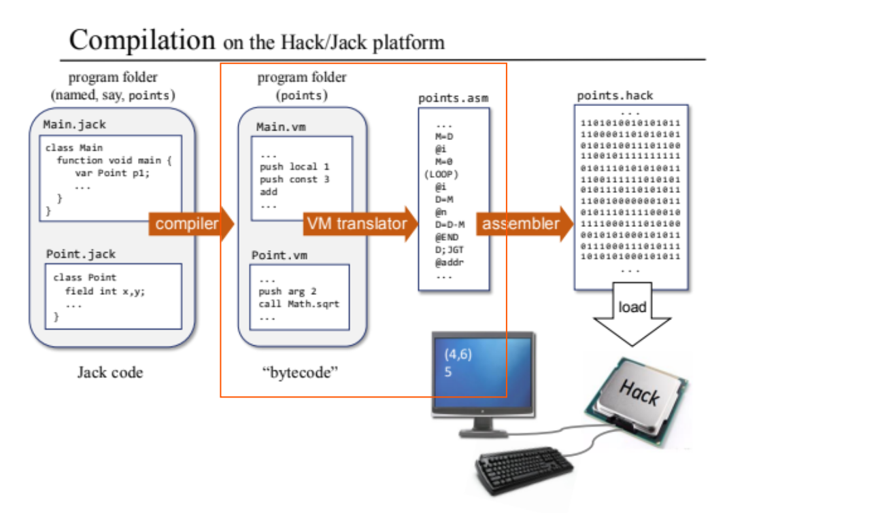

# Project 7: VM Translator I: Stack Arithmetic

In this project, I developed a VM translator that converts a subset of the VM language into Hack assembly code( .vm -> .asm). The translator handles:

- Arithmetic and logical operations: `add`, `sub`, `neg`, `eq`, `gt`, `lt`, `and`, `or`, `not` (`ArithmeticHandler.py`)
- Memory access commands: `push` and `pop` for the `constant`, `local`, `argument`, `this`, `that`, `temp`, `pointer`, and `static` segments (`PushPopHandler.py`)
[Stack Machine architecture]


## Files

- `VMTranslator.py` – Main script that parses VM commands and translates them into Hack assembly code. (Program control is not included, complete VM translator is done in `VM Translator II`)
- Test `.vm` files – Sample VM programs used to test the translator's functionality

Run the translator with a VM file or directory as input:
   ```bash
   python VMTranslator.py path/to/TheVMFile.vm
   ```



