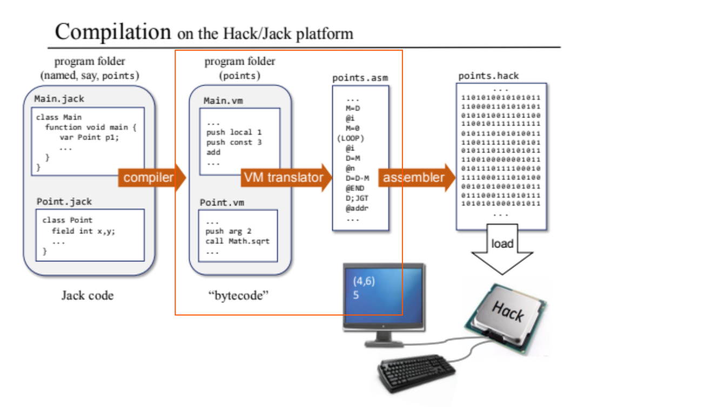
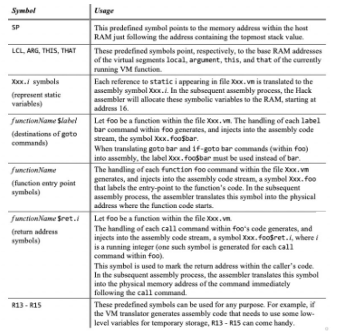
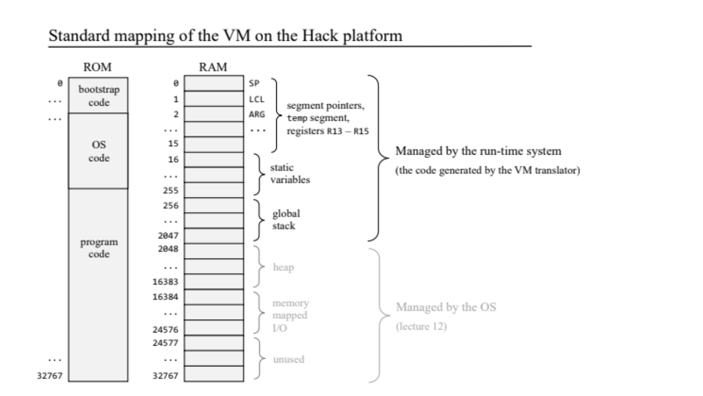

# Project 8: VM Translator II: Program Control

In this project, I developed a VM translator that converts a subset of the VM language into Hack assembly code( .vm -> .asm). The translator handles:

- Arithmetic and logical operations: `add`, `sub`, `neg`, `eq`, `gt`, `lt`, `and`, `or`, `not` (`ArithmeticHandler.py`)
- Memory access commands: `push` and `pop` for the `constant`, `local`, `argument`, `this`, `that`, `temp`, `pointer`, and `static` segments (`PushPopHandler.py`)
- Program control commands: `label`, `goto`, `if-goto` (`BranchingHandler.py`)
- Function commands: `function`, `call`, `return` (`FunctionHandler.py`)


## Files

- `VMTranslator.py` – Main script that parses VM commands and translates them into Hack assembly code. [complete version]
- Test `.vm` files – Sample VM programs used to test the translator's functionality.

Run the translator with a VM file or directory as input:
   ```bash
   python VMTranslator.py path/to/TheVMFile.vm
   ```



