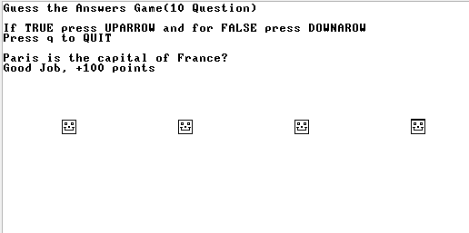
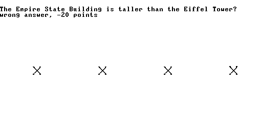
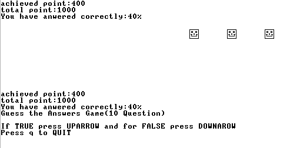

# Project 9: High-Level Language 

- Developed a simple interactive game in Hack assembly
- Utilizes basic **text output** and **animation** on the screen
- All logic is written directly in **Hack language**
- Runs on the **Hack computer emulator** 
- `my_game` – This directory houses the game's implementation in Jack language. The Jack code was then translated into VM and ASM formats using the `CompilationEngine.py` and `VMTranslator.py` tools, respectively. The final step involved converting the ASM code into binary format using the `asembler.py`, making it compatible with the Hack hardware developed in project 5.

