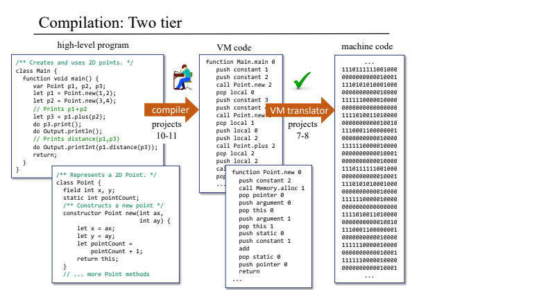
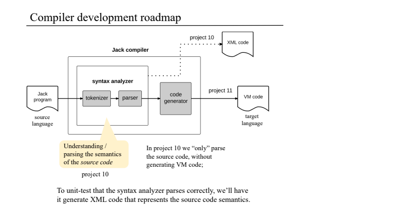

# Project 10: Compiler I: Syntax Analysis

The compiler parses Jack language files and generates XML output representing the syntactic structure of the code.

## Project Structure

The compiler consists of three main components:

1. **JackTokenizer.py**: Tokenizes Jack source code into individual language tokens.
2. **CompilationEngine.py**: Parses the tokens to generate a structured XML representation.
3. **JackAnalyzer.py**: Main driver program that coordinates the compilation process.

## How It Works

### Process Flow

1. The JackAnalyzer reads a .jack file or a directory containing .jack files
2. For each .jack file, it calls JackTokenizer to generate a tokenized XML file (XXXX-T.xml)
3. The CompilationEngine then parses these tokens to generate the final XML output (XXXX.xml)

### Components

#### JackTokenizer

- Breaks down Jack source code into tokens
- Classifies tokens as keywords, symbols, identifiers, string constants, or integer constants
- Handles special characters and comments
- Outputs a tokenized XML file (XXXX-T.xml)

#### CompilationEngine

- Implements recursive descent parsing based on Jack language grammar
- Reads the tokenized XML file
- Constructs and outputs a structured XML file representing the program's structure
- Handles various Jack language constructs:
  - Class declarations
  - Class variable declarations
  - Subroutine declarations
  - Parameter lists
  - Variable declarations
  - Statements (let, if, while, do, return)
  - Expressions and expression lists

#### JackAnalyzer

- Main entry point for the compiler
- Processes files and directories
- Coordinates the tokenization and parsing stages

## Usage

```bash
python JackAnalyzer.py <input_path>
```

Where `<input_path>` can be:
- A path to a single .jack file
- A path to a directory containing .jack files

## Output

For each input .jack file, the compiler produces:
1. A tokenized XML file (`XXXX-T.xml`)
2. A parsed XML file (`XXXX.xml`) representing the syntactic structure

## Example

Given a Jack file `Main.jack`, running:

```bash
python JackAnalyzer.py Main.jack
```

Will produce:
- `MainT.xml` - The tokenized version
- `Main.xml` - The parsed version showing the program's structure


## Note

This is the first part of the Jack compiler implementation, focusing on syntax analysis. The second part (Project 11) will extend this to include code generation for the Jack virtual machine.


