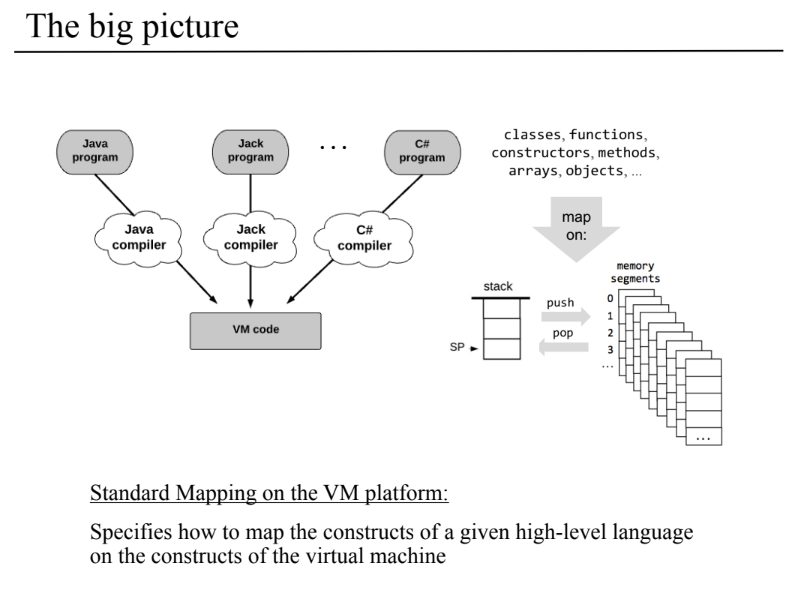
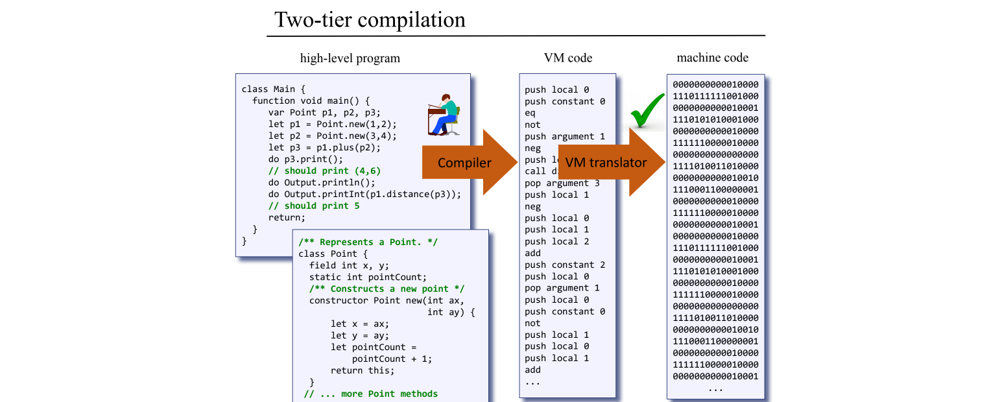

# Project 11: Compiler II - Code Generation

## Overview
This project implements a Jack compiler that translates Jack programs (a high-level language similar to Java/C#) into VM code for the Hack platform. The compiler is the second stage of a two-tier compilation system where:
1. Project 10 built the syntax analyzer (parsing)
2. Project 11 (this project) builds the code generator

The compiler processes Jack source files (.jack) and generates corresponding VM files (.vm) that can be executed by the VM Emulator.

## Components

### JackCompiler.py
The main driver program that:
- Takes a .jack file or directory as input
- Orchestrates the compilation process
- Calls the tokenizer and compilation engine

### JackTokenizer.py
Tokenizes Jack source code:
- Breaks the input into tokens
- Handles comments and whitespace
- Classifies tokens (keywords, symbols, identifiers, etc.)
- Generates a tokenized XML file (.T.xml) for intermediate representation

### CompilationEngine.py
The core of the compiler that:
- Parses the token stream
- Implements the compilation logic following Jack's grammar
- Generates VM code for various language constructs
- Handles class declarations, method calls, expressions, and statements

### symbolTable.py
Maintains symbol tables for variables:
- Tracks class-level and subroutine-level variables
- Manages variable scopes (static, field, argument, local)
- Provides variable lookup by name, type, and kind

### vmWriter.py
Emits VM code:
- Handles push/pop commands
- Translates arithmetic operations
- Manages control flow (if/goto/label)
- Handles function calls and returns

## Usage

Run the compiler with:

```
python JackCompiler.py [input]
```

Where `[input]` can be:
- A single Jack file (e.g., `Main.jack`)
- A directory containing multiple Jack files

## Implementation Details

### Compilation Process
1. The Jack source code is tokenized by JackTokenizer
2. CompilationEngine parses the tokens and generates VM code
3. VM code is written to output files

### Symbol Table
- Class-level variables (static/field) persist across methods
- Subroutine-level variables (argument/var) are reset for each subroutine
- Tracks type, kind, and index for each variable

### Code Generation Features
- Handles method/function/constructor calls
- Implements control flow (if/else, while)
- Supports arrays and string operations
- Manages memory allocation for objects
- Implements arithmetic and boolean operations

### Generated VM Code
- Functions are named as `ClassName.methodName`
- Local variables are stored in the local segment
- Field variables are stored in the this segment
- Static variables are stored in the static segment
- Arguments are stored in the argument segment

## Example Compilation

For a Jack class like:
```java
class Main {
   function void main() {
      do Output.printInt(42);
      return;
   }
}
```

The compiler would generate VM code similar to:
```
function Main.main 0
push constant 42
call Output.printInt 1
pop temp 0
push constant 0
return
```
**The generated VM code is then further compiled into .asm format by the [`VMTranslator`](../08/VMTranslator.py) and then to .hack (binary) by the [`Assembler`](../06/asembler.py) to execute on the Jack emulator.**





## Notes
- The compiler handles both direct and indirect method calls
- Object methods are called with 'this' as the first argument
- Constructors allocate memory for the object and return 'this'
- Arrays are implemented with pointer manipulation