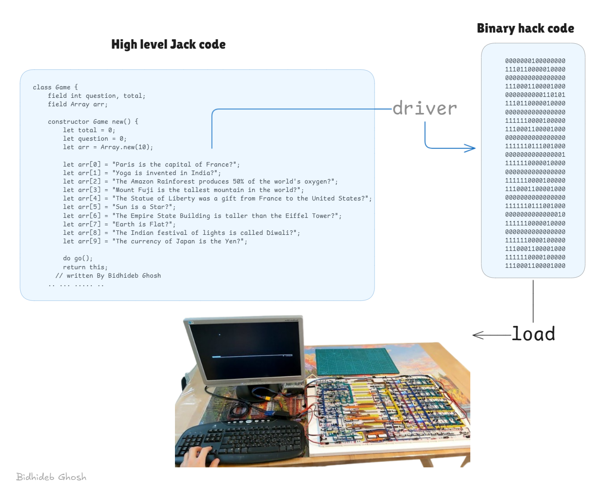

# Jack to Hack Driver

A complete compilation pipeline that transforms Jack high-level code into Hack binary machine code, enabling software development for the Hack computer platform(Built on project 05)

## Overview

This tool provides an end-to-end compilation process that includes:

1. **Jack Compiler**: Translates Jack (high-level language) files to VM code
2. **VM Translator**: Converts VM code to Hack assembly language
3. **Assembler**: Transforms assembly language into Hack binary machine code
## Usage

```bash
python main.py [directory_with_jack_files] [-k]
```

### Arguments

- `directory_with_jack_files`: Directory containing .jack files to compile
- `-k`: Optional flag to keep intermediate .vm and .asm files (they are deleted by default)

### Example

```bash
# Compile all Jack files in the Pong directory
python driver.py ./my_game

# Compile and keep intermediate files
python driver.py ./my_game -k
```

## How It Works

1. **Input Processing**: The script locates all .jack files in the specified directory
2. **Jack Compilation**: Jack files are compiled into VM code (.vm files)
3. **OS Library Integration**: Standard library files are automatically included if needed
4. **VM Translation**: All VM files are translated into a single assembly file (.asm)
5. **Assembly**: The assembly code is converted into Hack machine code (.hack)





