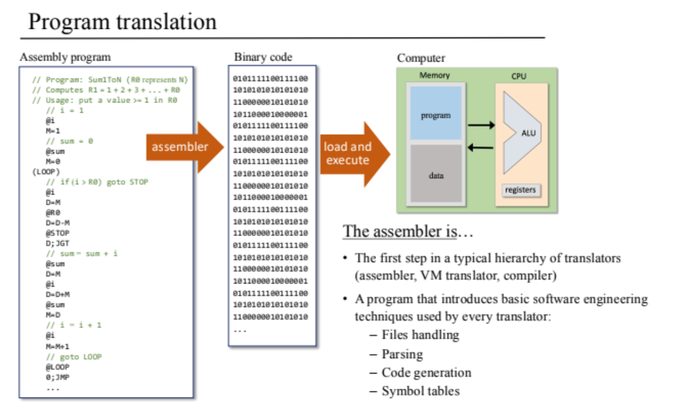

# Building a Modern Computer From First Principles
This project provides a hands-on journey through the entire computing hierarchy, from basic logic gates all the way to high-level applications. This implementation includes all components developed throughout the course (Projects 1-11) plus an additional integration driver that completes the compilation pipeline. I completed this project in 2021-22 to gain a comprehensive understanding of computer systems, from low-level hardware to high-level software.

# Projects
### [01: Boolean Logic](01)
### [02: Boolean Arithmetic](02)
### [03: Sequential Logic](03)
### [04: Machine Language](04)
### [05: Computer Architecture](05)
### [06: Assembler](06)
### [07: Virtual Machine I:](07)
### [08: Virtual Machine II:](08)
### [09: High Level Language](09)
### [10: Compiler I:](10)
### [11: Compiler II:](11)
### [12: Operating System](12)
### [12: Driver](./Driver/)

## `Go through all the README.md pages of each project for detailed understanding.`

## Quick look:

